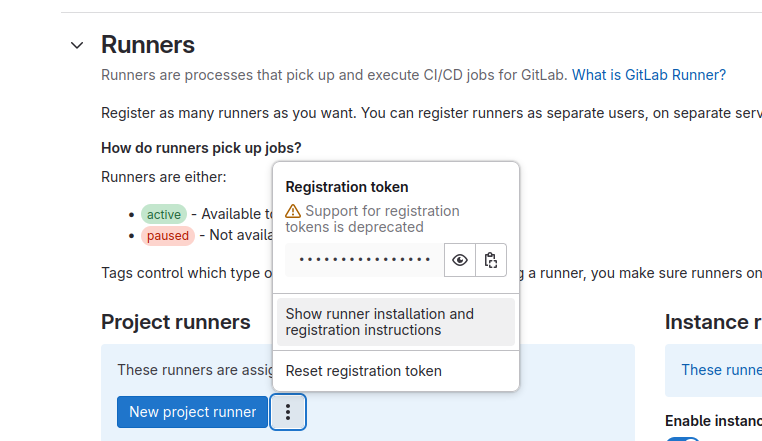
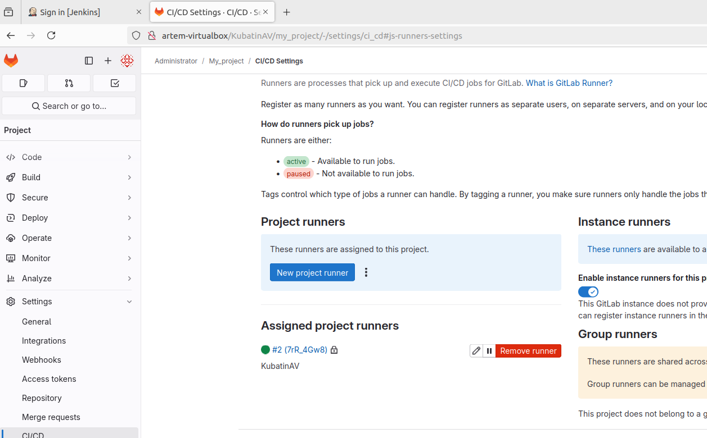
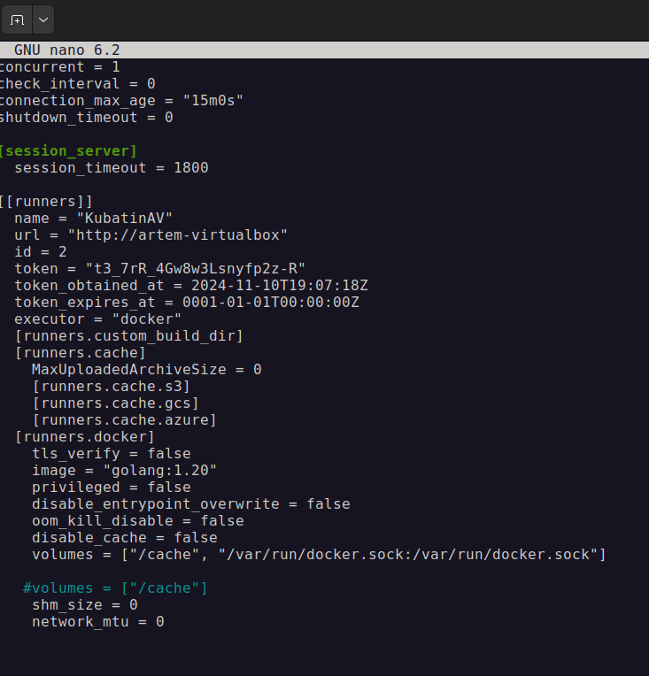
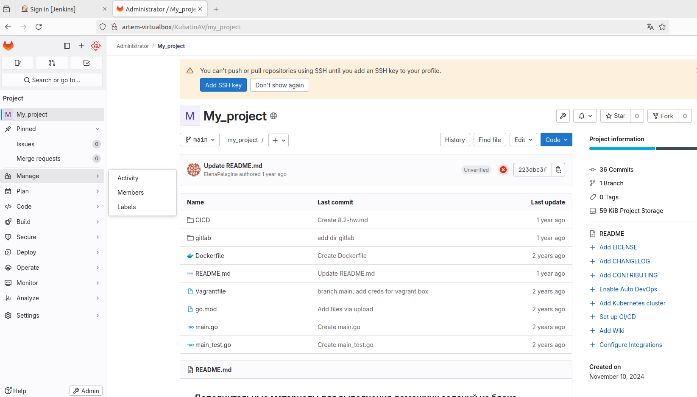
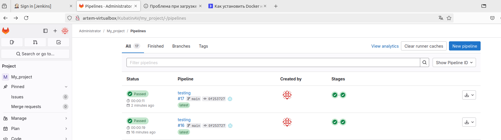
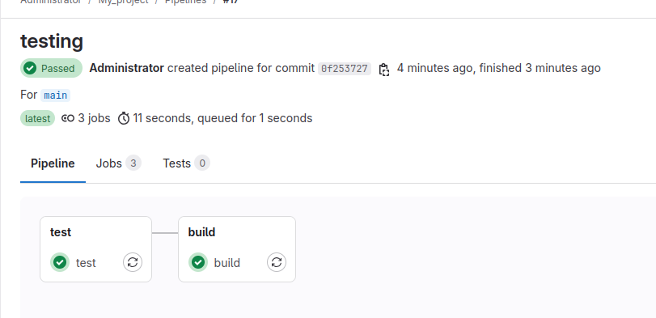

# Домашнее задание к занятию «GitLab»

### Задание 1

**Что нужно сделать:**

1. Разверните GitLab локально, используя Vagrantfile и инструкцию, описанные в [этом репозитории](https://github.com/netology-code/sdvps-materials/tree/main/gitlab).   
2. Создайте новый проект и пустой репозиторий в нём.
3. Зарегистрируйте gitlab-runner для этого проекта и запустите его в режиме Docker. Раннер можно регистрировать и запускать на той же виртуальной машине, на которой запущен GitLab.

В качестве ответа в репозиторий шаблона с решением добавьте скриншоты с настройками раннера в проекте.

### Решение:
1. установка gitlab
2. Обновим все компоненты операционной системы до последней версии apt update && apt upgrade -y
3. Установите зависимости, которые необходимы для работы: sudo apt install -y curl ssh openssh-server ca-certificates tzdata perl
4. Перейдите в директорию tmp и curl -LO https://packages.gitlab.com/install/repositories/gitlab/gitlab-ce/script.deb.sh
5. Запустите скрипт с помощью команды: sudo bash /tmp/script.deb.sh
6. sudo apt install gitlab-ce
7. Откройте конфигурационный файл Gitlab:
8. В строке external_url укажите ваш домен. Строка будет иметь следующий вид external_url ‘http://ip адрес сервера’
9. Обновите конфигурацию: sudo gitlab-ctl reconfigure
10. Выполните команду (Разрешаем исходящий трафик на порт 80): iptables -A INPUT -p tcp --dport 80 -j ACCEPT
11. Зайдите в веб-браузере на доменное имя вашего сервера GitLab: http://your_domain
12. логин root пароль в sudo nano /etc/gitlab/initial_root_password
13. создаем новый проект
14. Регистрация раннера:

```bash
   docker run -ti --rm --name gitlab-runner \
     --network host \
     -v /srv/gitlab-runner/config:/etc/gitlab-runner \
     -v /var/run/docker.sock:/var/run/docker.sock \
     gitlab/gitlab-runner:latest register
```
15. вставляем ссылку на наш сервер http://artem-virtualbox/
16. берем токен

17. указываем описание например kubatin-runner
18. выбираем интепретатор команд, пишем docker
19. выбираем имэдж golang:1.20
20. вставляем в /srv/gitlab-runner/config/config.toml
volumes = ["/cache", "/var/run/docker.sock:/var/run/docker.sock"]

21. запускаем
```bash
   docker run -d --name gitlab-runner --restart always \
     --network host \
     -v /srv/gitlab-runner/config:/etc/gitlab-runner \
     -v /var/run/docker.sock:/var/run/docker.sock \
     gitlab/gitlab-runner:latest
```
22. проверяем результат docker ps (что контейнер запущен)




---


### Задание 2

**Что нужно сделать:**

1. Запушьте [репозиторий](https://github.com/netology-code/sdvps-materials/tree/main/gitlab) на GitLab, изменив origin. Это изучалось на занятии по Git.
2. Создайте .gitlab-ci.yml, описав в нём все необходимые, на ваш взгляд, этапы.

В качестве ответа в шаблон с решением добавьте: 
   
 * файл gitlab-ci.yml для своего проекта или вставьте код в соответствующее поле в шаблоне; 
 * скриншоты с успешно собранными сборками.
 
 ### Решение:
1. клонируем и даем название ветки и задаем название директории git clone https://github.com/netology-code/sdvps-materials.git my_gitlab10.11
2. переходи в склонированную директорию cd my_gitlab10.11/
3. смотрим ремоуты git remote -v
4. добавляем новый с ссылкой на наш проект git remote add my_gitlab http://artem-virtualbox/KubatinAV/my_project.git
5. git push my_gitlab
6. файлы запушены

7. Создаем в директории нашего проекта nano .gitlab-ci.yml
8. вставляем:
```yaml
stages:
  - test
  - build

test:
  stage: test
  image: golang:1.17
  script: 
   - go test .

build:
  stage: build
  image: docker:latest
  script:
   - docker build .
```
9. добавляем изменения:
git status
git add .
git commit -am "master, add CI"
git log
git push my_gitlab
10. смотрим результат теста




---
## Дополнительные задания* (со звёздочкой)

Их выполнение необязательное и не влияет на получение зачёта по домашнему заданию. Можете их решить, если хотите лучше разобраться в материале.

---

### Задание 3*

Измените CI так, чтобы:

 - этап сборки запускался сразу, не дожидаясь результатов тестов;
 - тесты запускались только при изменении файлов с расширением *.go.

В качестве ответа добавьте в шаблон с решением файл gitlab-ci.yml своего проекта или вставьте код в соответсвующее поле в шаблоне.
